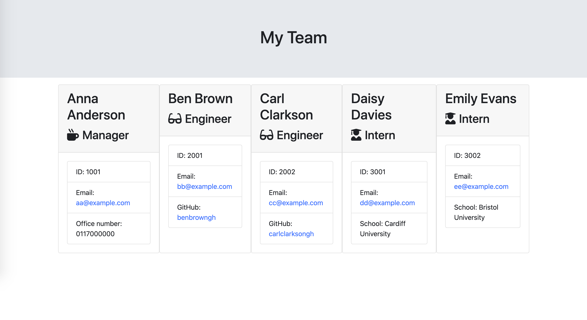

# team-profile-generator


## Description 

This project involves transforming the provided starter code into a fully functional Node.js command-line application. The primary objective is to create a tool that allows a manager to easily generate an HTML webpage containing essential information about the members of a software engineering team. The generated webpage will provide quick access to each team member's emails and GitHub profiles.

Screenshot of html file:


A set of initial code files, as depicted in the second commit, was given, featuring starter js and test.js files. The project then underwent further development, incorporating my recently acquired skills in Object-Oriented Programming. Below, I outline how these skills were seamlessly integrated into the project:

- Constructors & Prototype
- Test-Driven Development (derive code from test.js files)
- ES6 Classes

## Installation

In your terminal, change directory to a location where you would like to clone the repo, then run the below code line by line:
``` terminal
git clone git@github.com:ItIsMLiu/team-profile-generator.git
```
``` terminal
cd team-profile-generator
```
``` terminal
npm install
```

## Usage 

Here is the proofread version:

This application uses Jest for running unit tests and Inquirer for collecting input from the user. The application can be invoked using the following command:

``` terminal
node index.js
```

To launch the Team Profile Generator application, open your terminal and follow the installation steps outlined above. Subsequently, the user will receive prompts to provide information about the team manager, including the name, ID, email, and office number. Once the user completes these requirements, they are prompted to choose one of the options: Add an engineer, Add an intern, or Finish building the team.

If the user selects the engineer option, they are prompted to enter the engineer's information, and then they are taken back to the menu. Similarly, if the user selects the intern option, they are prompted to enter the intern's information before returning to the menu. Choosing to finish building the team allows the user to exit the application.

The command-line application will seamlessly process user input, and the HTML file 'team.html' is generated and stored in the output folder.

## Credits

Other resources used as guides:
- Inquirer: https://www.npmjs.com/package/inquirer

## License

MIT license (Please refer to the LICENSE in the repository).